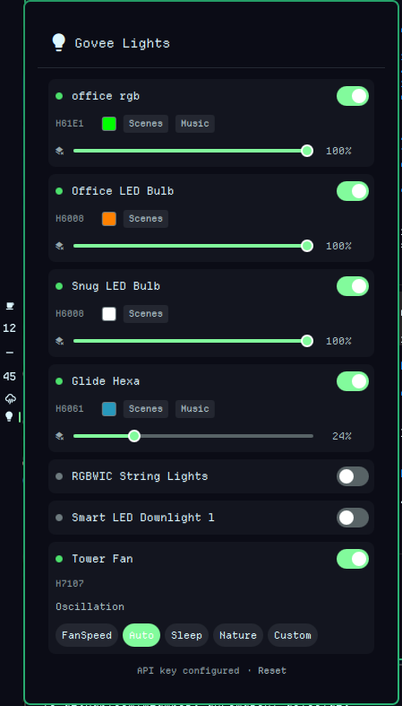

# Govee — Omarchy Shell Plugin

Control Govee smart lights and fans from the Omarchy desktop bar.



## Features

**Lights:**
- Power on/off toggle per device
- Brightness slider
- RGB color picker (HSV hue bar + saturation/value grid)
- Color temperature slider (2000K–9000K)
- Dynamic scenes — 240+ scenes organized by category (Nature, Mood, Music, Gaming, Party, Holiday, Cinema, Space, Dynamic) with collapsible groups
- Music mode — visualisation modes (Energic, Rhythm, Spectrum, etc.), sensitivity control, auto-color toggle, and fixed color picker

**Fans:**
- Power on/off
- Oscillation toggle
- Work mode selector (FanSpeed, Auto, Sleep, Nature, Custom)
- Speed slider (1–12)

**UX:**
- Devices that are off show only name + power toggle
- Offline/unplugged devices detected and shown as off
- Smart refresh — no flicker, diff-only state updates, timer resets on interaction
- Device groups (BaseGroup, SameModeGroup) filtered out
- Auto-refresh every 30 seconds while panel is open
- Middle-click bar icon to force refresh

## Requirements

- [Omarchy](https://omarchy.org/) 4.0+ (Quattro) with Quickshell
- `bash` (for subprocess orchestration)
- `curl` 7.55+ (for API requests; uses `-K -` config-from-stdin)
- A Govee Developer API key (free, see [Setup](#setup))

## Installation

```bash
omarchy plugin add https://github.com/mlambert-uk/omarchy-govee.git --enable
```

Or for local development:

```bash
ln -s /path/to/omarchy-govee ~/.config/omarchy/plugins/mlambert-uk.govee
omarchy plugin enable mlambert-uk.govee
```

## Removal

```bash
omarchy plugin disable mlambert-uk.govee
omarchy plugin remove mlambert-uk.govee
```

To also remove stored settings (API key):

```bash
rm -f ~/.local/state/omarchy/settings/govee.json ~/.local/state/omarchy/settings/govee-header
```

## Setup

1. Open the Govee Home app on your phone
2. Go to your profile → **Settings**
3. Tap **About Us** → **Apply for API Key**
4. Copy the API key you receive via email
5. Click the lightbulb icon in the bar — the plugin will prompt you to paste your key

The key is stored locally at `~/.local/state/omarchy/settings/govee.json`.

## Usage

- **Click** the bar icon to open the panel
- **Middle-click** the bar icon to refresh device states
- **Toggle** the switch next to each device to turn it on/off
- **Drag** the brightness slider to adjust
- **Click** the color swatch to open the color picker + temperature slider
- **Click** "Scenes" to browse dynamic scenes by category
- **Click** "Music" to activate music-reactive modes
- **Reset** link at the bottom clears your stored API key

Toggle via IPC/keybind:

```bash
omarchy-shell shell toggle mlambert-uk.govee
```

## File Structure

```
mlambert-uk.govee/
├── manifest.json        # Plugin metadata
├── BarWidget.qml        # Bar icon entry point
├── Panel.qml            # Main panel (setup, device list, state management)
├── DeviceCard.qml       # Per-device card (power, brightness, color, fan, music)
├── ColorPicker.qml      # HSV color picker component
├── SceneSelector.qml    # Categorized scene browser with grouped variants
├── GoveeApi.js          # API helpers (commands, parsing, color math)
├── LICENSE              # MIT License
└── README.md            # This file
```

## API Reference

This plugin uses the [Govee Developer API v2](https://developer.govee.com/docs/getting-started):

| Endpoint | Method | Purpose |
|----------|--------|---------|
| `/router/api/v1/user/devices` | GET | List devices and capabilities |
| `/router/api/v1/device/state` | POST | Query device state |
| `/router/api/v1/device/control` | POST | Send commands |
| `/router/api/v1/device/scenes` | POST | Fetch dynamic scenes |

Rate limits: 30 req/min for device list, 10 req/min/device for control, 30 req/min/device for state.

## Supported Devices

Any Govee device with a power switch is shown. Tested with:

- **H61E1** — LED strip (full RGB, scenes, music mode)
- **H6008** — LED bulb (color, scenes)
- **H6061** — Glide Hexa panels (color, scenes, music mode)
- **H70C4** — RGBWIC string lights (color, scenes, music mode)
- **H7075** — Smart LED downlight (color, scenes, music mode)
- **H7107** — Tower fan (oscillation, work modes, speed)

## Known Limitations

- The Govee API does not expose which scene is currently active — only scenes set from this plugin are highlighted
- Some device features (e.g. H7107 night light) are not exposed by the Govee cloud API
- Offline devices show as off — commands sent to them will silently fail
- Music mode uses the device's built-in microphone, not desktop audio

## License

MIT
